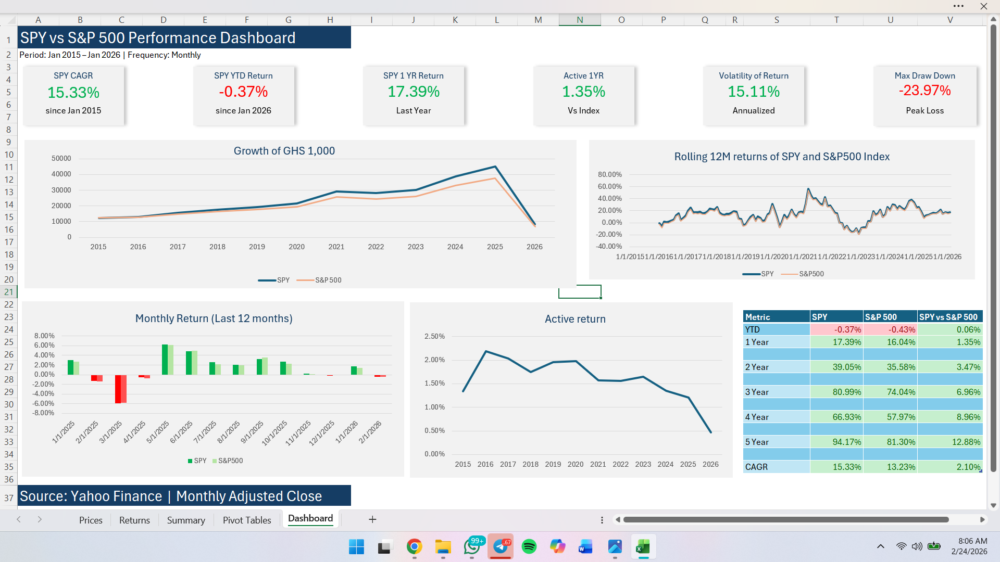

# 📊 SPY vs S&P 500 Performance Dashboard

Welcome to this financial data analysis project.

This dashboard compares the performance of the **SPDR S&P 500 ETF (SPY)** with the **S&P 500 Index** using monthly adjusted closing prices from **2015 to 2026**.

The goal of this project is to demonstrate financial data analysis and dashboard design using **Microsoft Excel**.

---

# Dashboard Preview

---

# What This Dashboard Shows

The dashboard analyzes several key investment metrics:

• Compound Annual Growth Rate (CAGR)  
• Year-to-Date (YTD) return  
• 1-Year return  
• Rolling 12-month returns  
• Active return vs benchmark  
• Return volatility  
• Maximum drawdown  

---

# Key Insights

• SPY achieved a **15.33% CAGR** from 2015–2026.

• Over the last **5 years**, SPY outperformed the index by **12.88% cumulative return**.

• The **maximum drawdown of -23.97%** highlights market risk during downturns.

• Rolling 12-month returns illustrate periods of strong performance and market corrections.

---

# Files in This Repository

| File | Description |
|-----|-----|
| `SPY_vs_SP500_Dashboard.xlsx` | Full interactive Excel dashboard |
| `dashboard-preview.png` | Screenshot of the dashboard |
| `demo-video.mp4` | Video demonstration of the dashboard |

---

# Data Source

Yahoo Finance  
Monthly Adjusted Closing Prices

---

# Tools Used

Microsoft Excel  
Financial Data Analysis  
Dashboard Design
